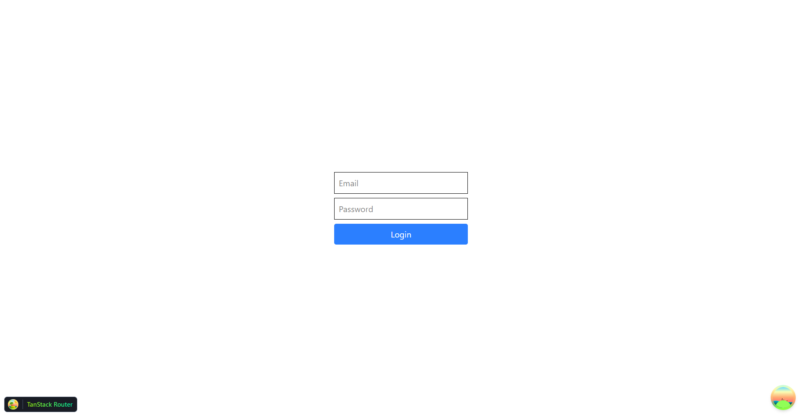
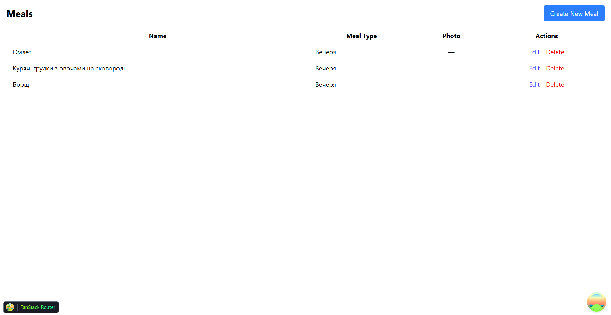
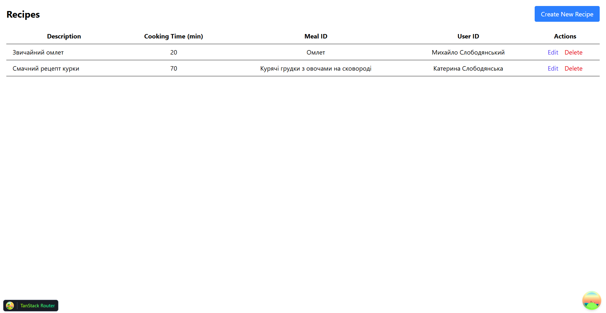
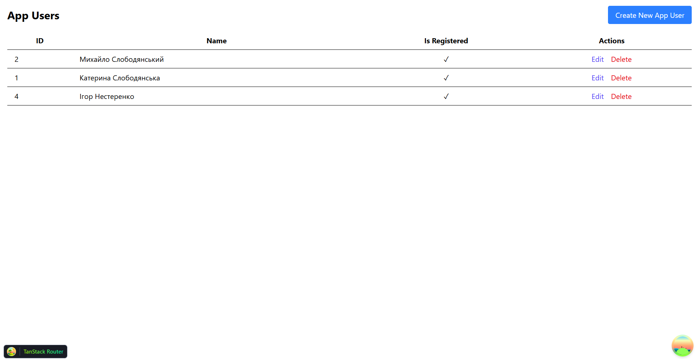
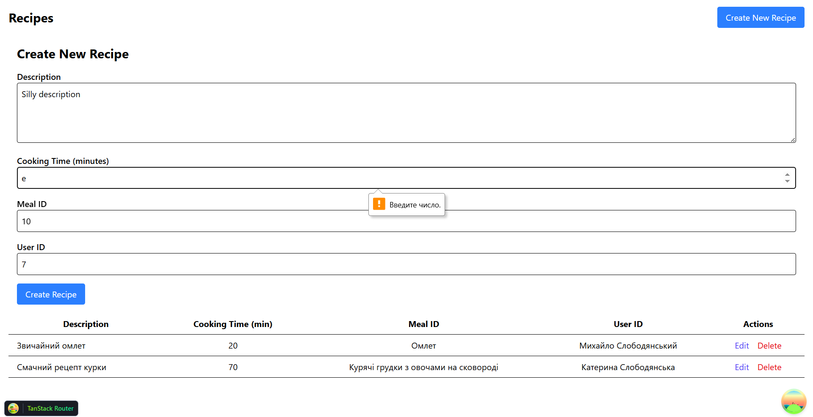

# Лабораторно-практична робота №8

### «Full-stack інтеграція: розробка UI на базі професійного бойлерплейту»

---

## Реалізований функціонал

У межах лабораторної роботи розроблено клієнтський застосунок для роботи з REST API, створеним на попередніх етапах курсового проєкту. Застосунок підтримує повний набір CRUD-операцій для ключової сутності системи. В основі використано бойлерплейт vite-react-boilerplate та сучасний стек інструментів: TanStack Query для роботи із серверним станом, TanStack Router для організації маршрутизації, React Hook Form у поєднанні з Zod для побудови та валідації форм, Axios для виконання HTTP-запитів. Окремо реалізовано сторінку автентифікації з використанням Zustand для зберігання JWT-токена.

---

## Приклади ключового коду

### Конфігурація Axios

Налаштовано інстанс Axios із базовою URL-адресою з змінної оточення та обробкою помилок через інтерцептор.
```typescript
import axios, { isAxiosError } from "axios";
import { useAuthStore } from '../store/auth';

const apiClient = axios.create({
	baseURL: String(import.meta.env["VITE_API_BASE_URL"]),
	headers: {
		"Content-Type": "application/json",
	},
});

apiClient.interceptors.request.use((config) => {
	const token = useAuthStore.getState().token;
	if (token) config.headers.Authorization = `${token}`;
	return config;
});

apiClient.interceptors.response.use(
	(response) => response,
	(error: unknown) => {
		if (isAxiosError(error)) {
			console.error(`API error ${error.name}: ${error.message}`);
			if (error.response?.status === 401 || error.response?.data.errorMessage === 'Authorization header not provided') {
				const { clearToken } = useAuthStore.getState();
				clearToken();
				window.location.href = '/login';
			}
			return Promise.reject(error);
		}
		return;
	}
);

export default apiClient;
```

### Хуки для TanStack Query

Створено хуки для кожної CRUD-операції (список, отримання за ID, створення, оновлення, видалення) з використанням TanStack Query. Хуки включають логіку навігації та інвалідування кешу після мутацій.

```typescript
import type { UseQueryResult } from "@tanstack/react-query";
// eslint-disable-next-line no-duplicate-imports
import { useMutation, useQuery, useQueryClient } from "@tanstack/react-query";
import { useNavigate } from '@tanstack/react-router';
import apiClient from '../../lib/axios';
import type { Meal } from './types';

const getMeals = async (): Promise<Array<Meal>> => {
	const response = await apiClient.get('/meals');
	return response.data as Array<Meal>;
}

const getMealById = async (id: string): Promise<Meal> => {
	const response = await apiClient.get(`/meals/${id}`);
	return response.data as Meal;
}

const createMeal = async (newMeal: Omit<Meal, 'id'>): Promise<Meal> => {
	const response = await apiClient.post('/meals', {
		name: newMeal.name,
		mealName: newMeal.mealType,
		photo: newMeal.photo
	});
	return response.data as Meal;
}

const updateMeal = async ({ id, data }: { id: string, data: Partial<Meal> }): Promise<Meal> => {
	const payload: any = {};
	if (data.name) payload.name = data.name;
	if (data.mealType) payload.mealName = data.mealType;
	if (data.photo !== undefined) payload.photo = data.photo;

	const response = await apiClient.patch(`/meals/${id}`, payload);
	return response.data as Meal;
}

const deleteMeal = async (id: string): Promise<void> => {
	await apiClient.delete(`/meals/${id}`);
}

export const useMeals = (): UseQueryResult<Array<Meal>, Error> => useQuery<Array<Meal>>({ queryKey: ['meals'], queryFn: getMeals });

export const useMeal = (id: string): UseQueryResult<Meal, Error> => useQuery<Meal>({ queryKey: ['meals', id], queryFn: () => getMealById(id) });

export const useCreateMeal = () => {
	const queryClient = useQueryClient();
	const navigate = useNavigate();

	return useMutation({
		mutationFn: createMeal,
		onSuccess: async () => {
			await queryClient.invalidateQueries({ queryKey: ['meals'] });
			await navigate({ to: '/meals' });
		},
	});
};

export const useUpdateMeal = () => {
	const queryClient = useQueryClient();
	const navigate = useNavigate();

	return useMutation({
		mutationFn: updateMeal,
		onSuccess: async (updatedMeal) => {
			await queryClient.invalidateQueries({ queryKey: ['meals'] });
			queryClient.setQueryData(['meals', updatedMeal.id], updatedMeal);
			await navigate({ to: '/meals' });
		},
	});
};

export const useDeleteMeal = () => {
	const queryClient = useQueryClient();

	return useMutation({
		mutationFn: deleteMeal,
		onSuccess: async () => {
			await queryClient.invalidateQueries({ queryKey: ['meals'] });
		}
	})
}
```

### Схема Zod

Розроблено схему Zod для валідації даних форми, що забезпечує перевірку введених даних перед відправкою на сервер.
```typescript
const mealSchema = z.object({
	name: z.string().min(2, "Name is too short"),
	mealType: z.nativeEnum(MealName, {
		errorMap: () => ({ message: "Please select a meal type" })
	}),
	photo: z.string().nullable().optional(),
});
```
---

## Скріншоти

### Сторінка логіну


### Сторінка для страв


### Сторінка для рецептів


### Сторінка для юзерів


### Валідація zod

